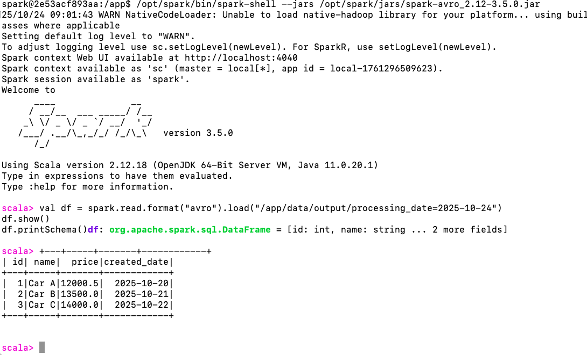

Summary of What's Now Working ✅

✅ CSV Reading: 6 records read, 1 malformed dropped
✅ Type Casting: All 9 types (Integer, Long, Float, Double, Boolean, Date, Timestamp, Decimal, String)
✅ Error Handling: 5 casting failures logged with sample rows
✅ Validation: Null id rows filtered
✅ Deduplication: Duplicate id=1 removed (4 records written)
✅ Partitioning: By processing_timestamp (TimestampType)
✅ Logging: Structured Log4j logs with stats
✅ CLI Args: Working (tested with --destDir)
✅ Avro Output: Proper schema with all cast types

Result: 
